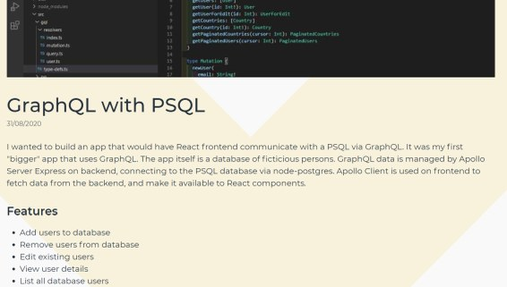

I wanted to build an app that would have React frontend communicate with a PSQL via GraphQL. It was my first "bigger" app that uses GraphQL. The app itself is a database of ficticious persons. 
GraphQL data is managed by Apollo Server Express on backend, connecting to the PSQL database via node-postgres. Apollo Client is used on frontend to fetch data from the backend, and make it available to React components.

Second part of the app, added later, is authenitcation via JWT. Access and refresh tokens are used to log in and register users, as well as to control access to protected routes. 

### Features

- Add, remove and edit uses in datatabase
- List all database users
- User data holding user id, first and last name, country, city, and age
- Paginated fetching of users 
- Register profile
- Log into account
- Automatic login on revisiting the app
- Refreshing login during browsing session

### Technical information

- React
- GraphQL
- Apollo Client
- Apollo Server Express
- TypeScript
- React Router
- Styled Components
- Node-Postgres
- JWT
- Bcrypt

### Available at

- [Github repo - frontend](https://github.com/ikaem/graphql-jwt-react)
- [Github repo - backend](https://github.com/ikaem/graphql-jwt-api)
- [Blog series - psql](https://ikaem.github.io/angry-chaired-blog/categories/graphql-react-psql/)
- [Blog series - jwt](https://ikaem.github.io/angry-chaired-blog/categories/https://github.com/ikaem/graphql-jwt-api/)

### Screenshots

- 
- 