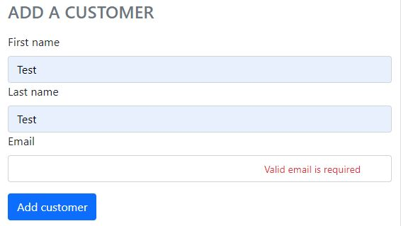
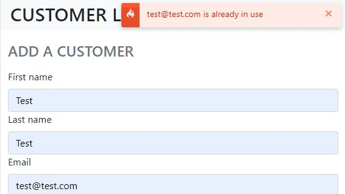

A fullstack app created with React and Node.js, using Mongoose to store a list of people. TypeScript is used throughout the app, Express-validator is used on backend to validate data coming in to be stored into the database. Frontend uses Axios to fetch data from the api, Redux for state management, and React Hook From and Yup to work with forms and validate form inputs, respectively. Sass is combined with Bootstrap for simple styling of the app. Also used are React hooks and React Toast Notifications on frontend, and custom errors and middlewares on the backend.

### Features

- List of people with email addresses
- Add new people to the list
- Remove people to the list
- Cannot add people with emails that are already used
- Input validation on backend and frontend

### Technical information

- React
- Node.js
- Express
- Bootstrap
- React Redux
- React Thunk
- Express-validator
- MongoDB
- Mongoose
- React Hook Form
- Yup

### Available at

- [Live site](https://kmpr-client.herokuapp.com/)
- [Github repo - client](https://github.com/ikaem/kmp-client)
- [Github repo - api](https://github.com/ikaem/kmp-api)

### Screenshots

- 
- 
