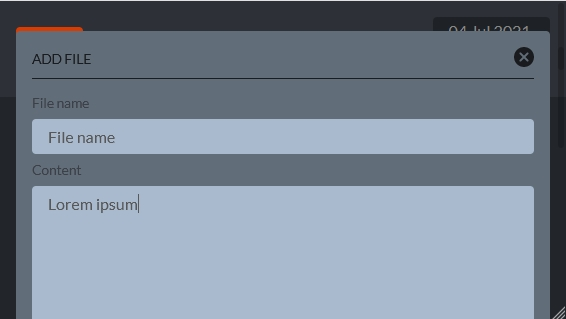
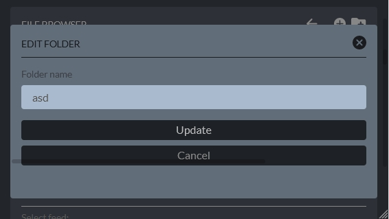

A React app simulating a simple OS. Typescript is used throughout the app, React Context is used to provide support for the filesystem, and local storage is used to save filesystem state session. The app uses Sass for styling, React hooks for easier dealing with React Context, and Axios to fetch RSS articles. React router is also used to navigate between login and home screens, and Yup and React Hook Form are used to handle validation when creating and editing files and folders.

### Features

- Login and logout from the OS
- Browse the filesystem
- Create, edit, delete, and sort text files and folders
- Digital clock
- RSS Reader and articles pagination
- Filesystem stored between browser sessions
- Responsive styling

### Technical information

- React
- Sass
- React Context and hooks
- React Hook Form
- Yup
- TypeScript
- React Router
- Axios

### Available at

- [Live site](https://labs-ost.herokuapp.com/home)
- [Github repo](https://github.com/ikaem/labs)

### Screenshots

- 
- 
