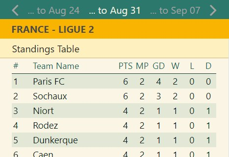
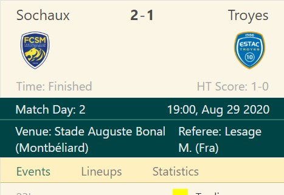

A small app that show results from English Championship and French Ligue 2 competitions. Football results are retrieved from an API provided by apifootball.com.

### Features

- Football results for each round of a season competition
- Future and past match fixtures
- Individual match reports, including scores, scorers, yellow and red cards, substitutions, match date and venue 
- League standings overview
- Responsive layout

### Technical information

- React
- Express
- CSS Modules
- Axios
- React Router
- apifootball.com

### Available at

- [Live site](https://didwewintoo.herokuapp.com/matches)
- [Github repo - frontend](https://github.com/ikaem/did-we-win-v2)
- [Github repo - backend](https://github.com/ikaem/did-we-win-api)

### Screenshots

- 
- 