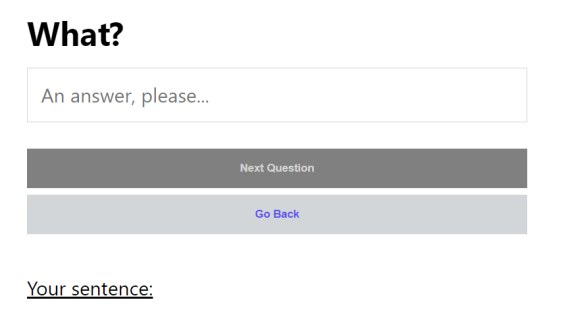
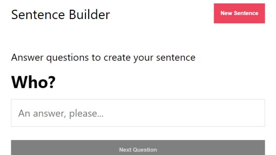

Simple sentence-building game create with React and with Test Driven Developement. Jest is used as a test runner. Enzyme is used for unit and integration testing of the app.

### Features

- App functionalities tested prior deployment.
- App allows submission of pre-set answers, in order to assemble a sentence
- User can switch questions back and forth, in order to edit previous answers, or to get to a new question
- Option to start a new sentence
- Responsive layout

### Technical information

- React
- Jest
- Enzyme
- Styled Components 
- TypeScript 

### Available at

- [Live site](https://sentence-game.herokuapp.com/)
- [Github repo](https://github.com/ikaem/sentence-game)
- [Blog series](https://ikaem.github.io/angry-chaired-blog/categories/react-test-driven-development-with-jest-enzyme/)

### Screenshots

- 
- 