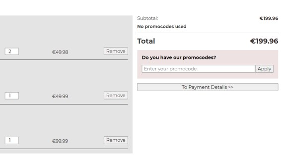
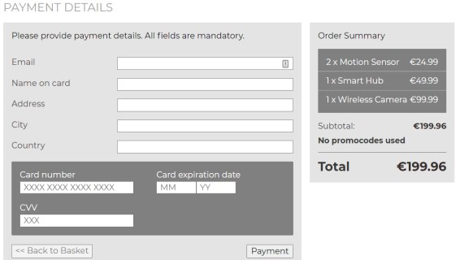

The Web Shop is a small React application made as a part of job application. The app uses Express and Mongoose on backend, and allows use of promo-codes to get discounts on products. 

### Features

- Adding and removing items from basket
- Adding and removing promo-codes to selected products
- Applying sales prices in case of certaing product quantity
- Checkout of products in the basket
- Required customer details to checkout products
- Order summary after completing checkout

### Technical information

- React
- Styled Components
- Axios
- React Router
- Mongoose
- MongoDB
- Express

### Available at

- [Live project](https://placeholder-react.herokuapp.com/)
- [Github repo - api](https://github.com/ikaem/placeholder-api)
- [Github repo - frontend](https://github.com/ikaem/placeholder-react)

### Screenshots

- 
- 