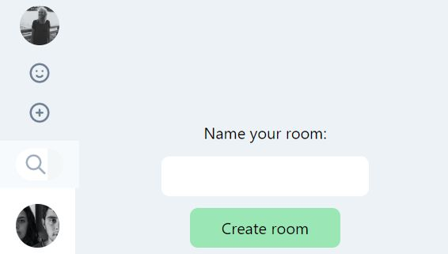
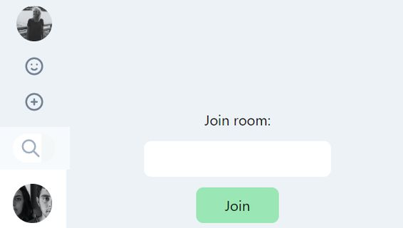

A basic WhatsApp clone made with React and Webpack. It uses Socket.io for real-time data transfer between client and backend. Frontend part is styled with Tailwind, and backend is made with Express. Both ends are written in TypeScript and hosted on Heroku. 
This is first part of the project where I wanted to learn to work with Webpack, Babel and Socket.io.
In the next part I plan to add MongoDB as a database to store messages and user profiles. I will implement user authentication and will also use Apollo and GraphQL to manipulate data on both ends. I would like to add few more features such as contacts and messages serch, invite users for private chats, delete rooms and messages, and more.

### Features

- Join the chat with a selected username
- Create chat rooms
- Join Chat rooms
- Create messages

### Technical information

- React
- Tailwind
- Webpack
- Babel
- TypeScript
- Socket.io
- Express

### Available at

- [Live project](https://shima-react-webpack.herokuapp.com/)
- [Github repo - api](https://github.com/ikaem/shima-api)
- [Github repo - frontend](https://github.com/ikaem/shima-react-webpack)
- [Blog series](https://ikaem.github.io/angry-chaired-blog/categories/whatsapp-react-webpack/)

### Screenshots

- 
- 